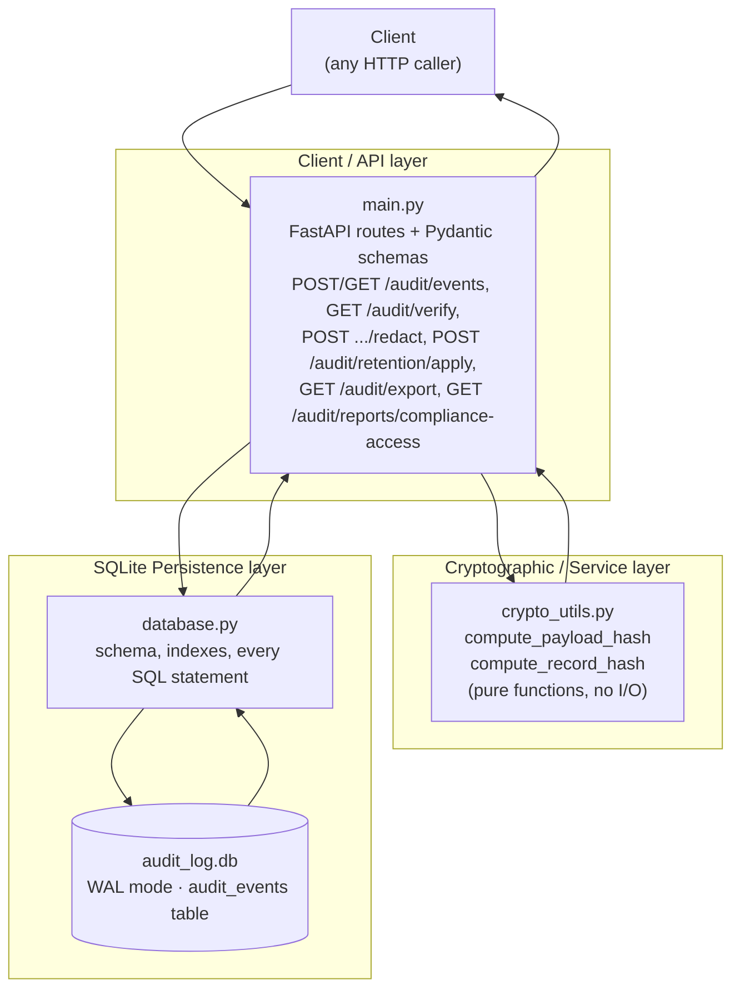
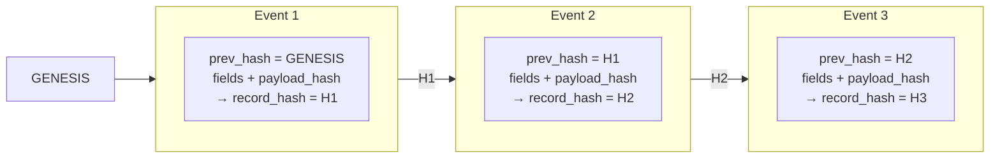
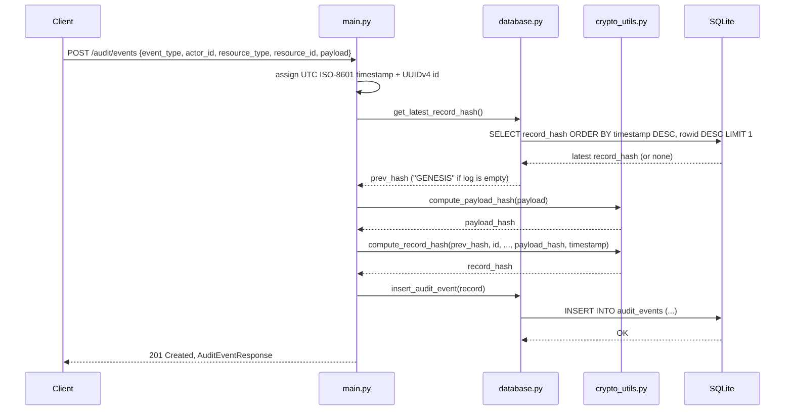
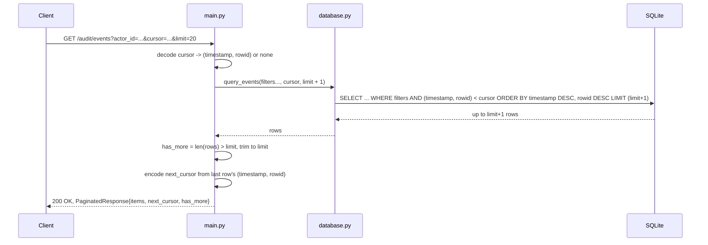
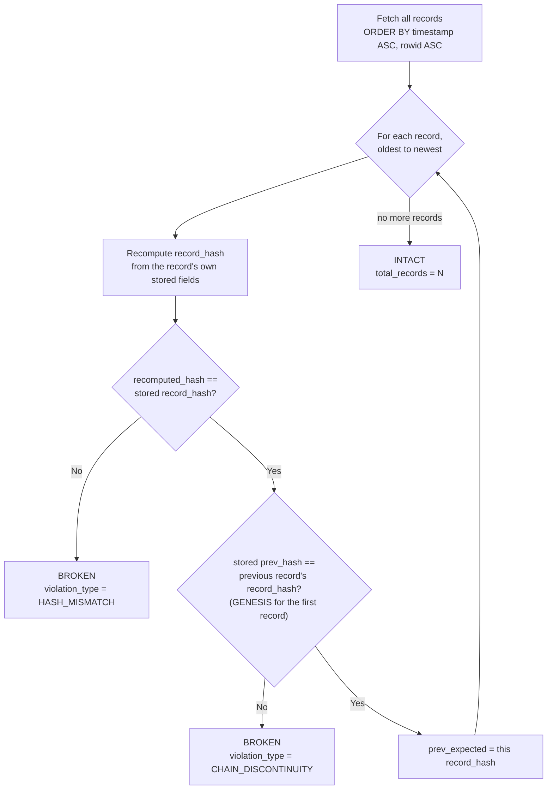
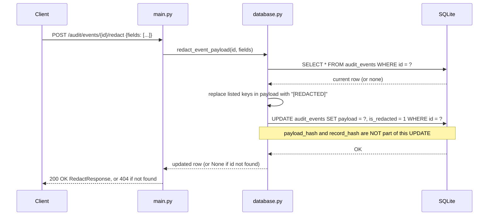
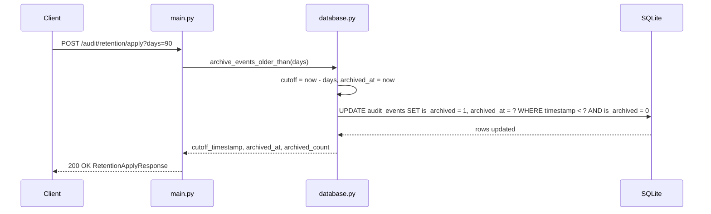
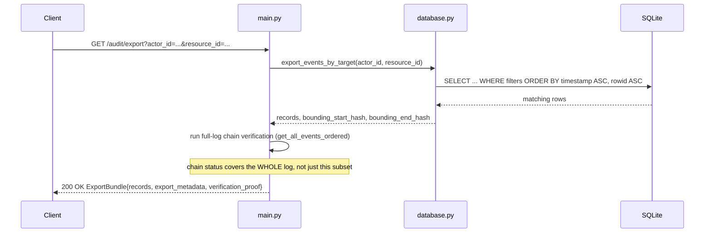
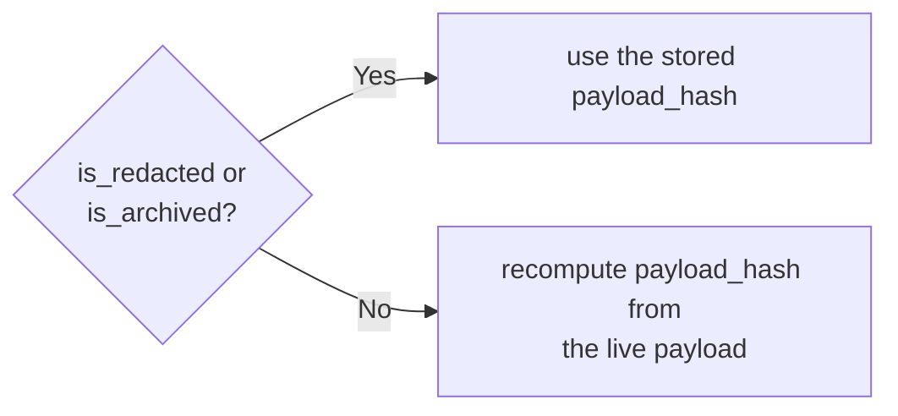
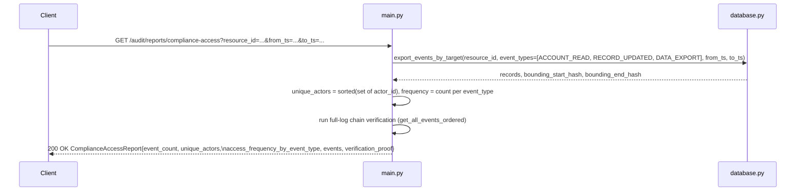

# Architecture

## Overview

The audit log service is a small FastAPI application backed by a single SQLite
file. Scenario A gives it three endpoints -- append an event, query events,
and verify the log's integrity -- and is deliberately **append-only**: there
is no generic update or delete endpoint anywhere in the API surface.
Scenarios B and C (see their own sections below) add redaction, retention,
export, and a compliance-access report on top of that same log, without
weakening the append-only guarantee for anything they don't explicitly
touch.

Every event is cryptographically chained to the one before it (a hash
chain, the same idea behind a blockchain or a git commit history), so any
edit, deletion, or reordering of a past record is detectable by walking the
chain and recomputing hashes.

## System layers

- **main.py** -- FastAPI routes, Pydantic request/response schemas, and the
  `lifespan` hook that calls `init_db()` on startup.
- **crypto_utils.py** -- pure functions with no I/O: canonical payload
  hashing and the chained record hash.
- **database.py** -- the only code that touches SQLite. Opens a fresh
  connection per call (WAL journal mode, bounded lock `timeout`), and is the
  sole place that knows the table schema and SQL.
- **audit_log.db** -- a single SQLite file, one table (`audit_events`).

## Hash algorithm and chain design

**Why SHA-256.** Every hash in this system -- `payload_hash` and
`record_hash` -- is SHA-256 (via Python's `hashlib`, no external
dependency). It was chosen over alternatives for three concrete reasons:
it is cryptographically collision-resistant for this threat model (unlike
MD5 or SHA-1, both of which have practical collision attacks), it is
available in the standard library with hardware acceleration on virtually
every modern CPU, and a 256-bit digest is more than large enough that
brute-forcing a second payload with the same hash is not a realistic
concern here. Nothing about the design depends on SHA-256 specifically --
`crypto_utils.py` is the one place the algorithm choice lives -- but there
was no reason in this assignment's scope to reach for a heavier
alternative (e.g. SHA-3) or a keyed/HMAC construction (which would require
key management this system doesn't otherwise need).

**Canonical JSON payload hashing.** `compute_payload_hash` serializes the
payload with `json.dumps(payload, sort_keys=True, separators=(",", ":"))`
before hashing. Both choices matter: `sort_keys=True` means two payloads
with identical data but different key insertion order hash identically
(Python dicts, and JSON objects in general, don't guarantee key order is
meaningful), and the compact `separators=(",", ":")` eliminate the
whitespace differences a naive `json.dumps(payload)` would otherwise
introduce (`{"a": 1}` vs. `{"a":1}` are the same data but different bytes,
and therefore different hashes, without canonicalization). Without this
step, semantically identical payloads could hash differently depending on
incidental formatting, which would make `record_hash` reproducibility
fragile in exactly the place it needs to be strongest.

**`record_hash` and the chain.** `compute_record_hash` hashes
`prev_hash | id | event_type | actor_id | resource_type | resource_id |
payload_hash | timestamp` (pipe-joined, then SHA-256). Binding in
`prev_hash` is what turns a list of independently-hashed rows into an
actual *chain*: each record's hash depends on the one before it, so
changing, deleting, or reordering any past record changes that record's
hash and, transitively, invalidates every hash after it.

**`rowid`-based sequence linkage.** Two records can legitimately share the
same one-second-resolution `timestamp`. Ordering and pagination originally
broke such ties using the public `id` -- but `id` is a random UUIDv4 with
no relationship to insertion order, so tiebreaking on it could occasionally
present, verify, or paginate same-second events out of the order their
hash chain was actually built in (this was a real bug found during
development; see `AI_LOG.md` Entry 5). The fix ties every ordered query to
SQLite's implicit `rowid` instead: because `audit_events`'s declared
primary key (`id`) is `TEXT`, not `INTEGER`, SQLite does *not* alias it to
`rowid`, so the table still carries a normal, hidden `rowid` that increases
strictly with true insertion order (this table is append-only -- rows are
never deleted, so there is no `rowid` reuse to worry about). `prev_hash`
still binds each record to its logical predecessor's `record_hash`;
`rowid` is only what lets queries and pagination reconstruct *which* row
that predecessor is, correctly, even when timestamps collide.

## Data model and indexing

`audit_events` is the only table in the system:

| Column | Type | Purpose |
| --- | --- | --- |
| `id` | `TEXT PRIMARY KEY` | Public UUIDv4 identifier, server-assigned |
| `event_type` | `TEXT NOT NULL` | e.g. `LOGIN`, `ACCOUNT_READ`, `DATA_EXPORT` |
| `actor_id` | `TEXT NOT NULL` | Who performed the action |
| `resource_type` | `TEXT NOT NULL` | What kind of resource was acted on |
| `resource_id` | `TEXT NOT NULL` | Which specific resource |
| `payload` | `JSON NOT NULL` | Event details; `CHECK (json_valid(payload) AND json_type(payload) = 'object')`; the one column redaction overwrites in place |
| `payload_hash` | `TEXT NOT NULL` | SHA-256 of the *original* payload, persisted at ingestion (Scenario B) |
| `timestamp` | `TEXT NOT NULL` | Server-assigned UTC ISO-8601, `YYYY-MM-DDTHH:MM:SSZ` |
| `prev_hash` | `TEXT NOT NULL` | The previous record's `record_hash` (`"GENESIS"` for the first record) |
| `record_hash` | `TEXT NOT NULL` | SHA-256 chaining this record to `prev_hash` |
| `is_redacted` | `BOOLEAN NOT NULL DEFAULT 0` | Set once any payload field has been redacted (Scenario B) |
| `is_archived` | `BOOLEAN NOT NULL DEFAULT 0` | Set by the retention policy (Scenario B) |
| `archived_at` | `TEXT` | UTC timestamp of archiving; `NULL` until then |

Indexes:

| Index | Columns | Purpose |
| --- | --- | --- |
| `idx_audit_events_ts_id` | `(timestamp DESC)` | Backs every ordered scan and keyset-paginated query. SQLite does not allow `rowid` inside a `CREATE INDEX` column list, but it implicitly appends `rowid` to every index on a rowid table already, so this index alone correctly supports the `(timestamp, rowid)` ordering described above -- no separate index on `rowid` is needed or possible. |
| `idx_audit_events_actor` | `(actor_id)` | `actor_id` filters on `GET /audit/events`, `GET /audit/export`, and the compliance report |
| `idx_audit_events_resource` | `(resource_type, resource_id)` | Composite filter used by `GET /audit/events`, `GET /audit/export`, and `GET /audit/reports/compliance-access` |
| `idx_audit_events_event_type` | `(event_type)` | `event_type` filtering, including the Scenario C fixed allow-list |

The composite `(resource_type, resource_id)` index specifically is what
Scenario C's design leans on for its query-performance assumption (see
[SCENARIO_C_COMPLIANCE_REPORTING.md](SCENARIO_C_COMPLIANCE_REPORTING.md)).
The `rowid` tiebreak above is what prevents the timestamp-tie reordering
bug from recurring: without it, two indexed-but-untied columns
(`timestamp`, `id`) could still produce a sort order that doesn't match
true insertion/chain order whenever a timestamp collision occurs.

## Write path: `POST /audit/events`

The server -- never the client -- assigns the `id` and `timestamp`, which is
what prevents a caller from manipulating ordering or backdating an event.

## Read path: `GET /audit/events`

Fetching `limit + 1` rows lets the API decide `has_more` from the extra row
alone, avoiding a second `COUNT(*)` query.

## Verification path: `GET /audit/verify`

`HASH_MISMATCH` catches a record whose own fields were edited in place;
`CHAIN_DISCONTINUITY` catches a record that was inserted, deleted, or
reordered relative to its neighbors. The endpoint returns the first
violation found and stops there. Scenario B refines exactly which
`payload_hash` value feeds into this check -- see "Verification, refined"
below.

## Concurrency and storage

- SQLite runs in **WAL (write-ahead log)** mode, so concurrent readers
  (`GET /audit/events`, `GET /audit/verify`) do not block the single writer
  (`POST /audit/events`), and vice versa.
- Every connection opens with a `timeout`, so a request waiting on a lock
  fails with a clear error instead of hanging indefinitely.

## Scenario B: Redaction, Retention, and Export

Building on the append-only log above, three more endpoints let a record's
payload be redacted, older records be archived, and a subset of the log be
exported for offline verification -- without ever deleting a row or
breaking the hash chain. The full cryptographic reasoning and threat model
are in [REDACTION_DESIGN.md](REDACTION_DESIGN.md); this section covers the
request flow for each endpoint.

### Redaction: `POST /audit/events/{record_id}/redact`

This is the one deliberate exception to "append-only, no in-place edits" --
see [REDACTION_DESIGN.md](REDACTION_DESIGN.md) for why leaving
`payload_hash`/`record_hash` untouched keeps the chain valid.

### Retention: `POST /audit/retention/apply`

Archiving never deletes a row: archived records stay fully queryable via
`GET /audit/events` and are still walked by `GET /audit/verify`.

### Export: `GET /audit/export`

`verification_proof` carries each exported record's own
`prev_hash`/`record_hash`/`payload_hash`, plus the subset's
`bounding_start_hash`/`bounding_end_hash` -- the entry and exit points of
this (possibly filtered) subset within the larger chain -- so a recipient
can recompute and confirm each record's `record_hash` offline without
needing the rest of the log.

### Verification, refined

`GET /audit/verify`'s per-record check (see the Verification path section
above) now branches on whether a record has been redacted or archived:

Everything else -- the `record_hash` recomputation and the `prev_hash`
chain-linkage check -- is unchanged. See
[REDACTION_DESIGN.md](REDACTION_DESIGN.md) for exactly what this does and
does not still catch, including the one non-obvious trade-off: this same
exemption also applies to archived-but-not-redacted records, even though
archiving alone never touches the payload.

## Scenario C: Compliance Access Reporting

`GET /audit/reports/compliance-access` is a read-only report built entirely
on top of Scenario B's export engine -- it adds no new persistence logic.

`event_types` is a fixed, non-configurable allow-list, not a client
parameter -- see
[SCENARIO_C_COMPLIANCE_REPORTING.md](SCENARIO_C_COMPLIANCE_REPORTING.md)
for the requirements decomposition behind that choice, and for what was
explicitly scoped out of this endpoint.
