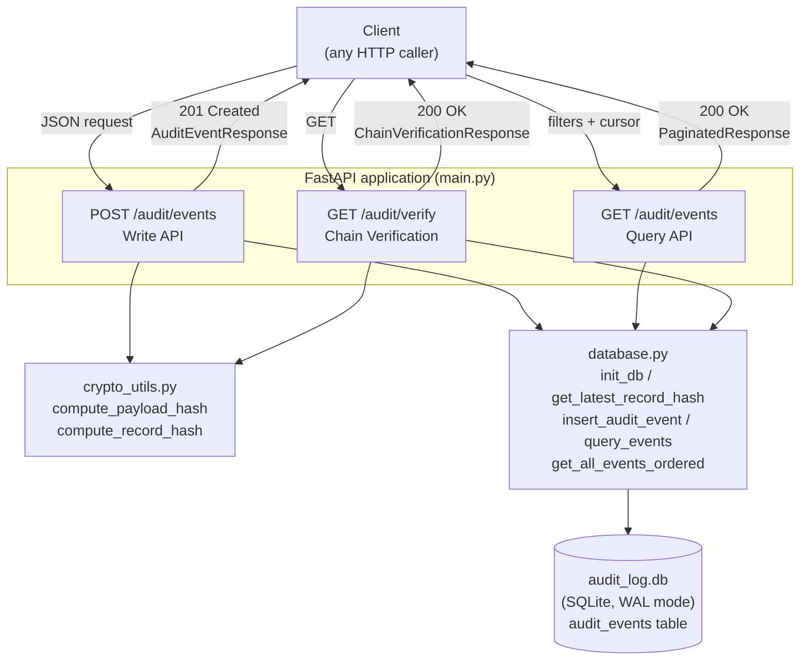
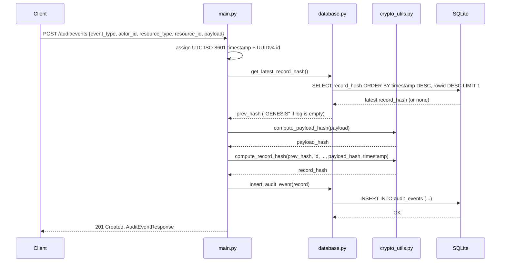
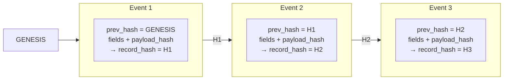
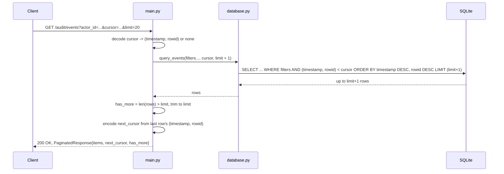
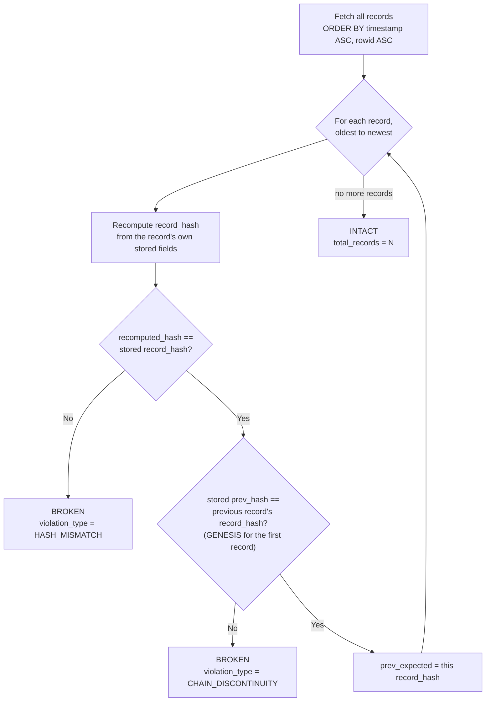
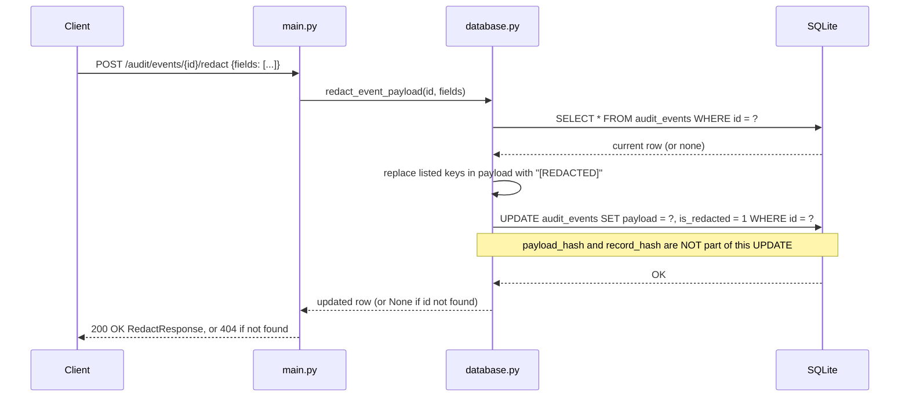
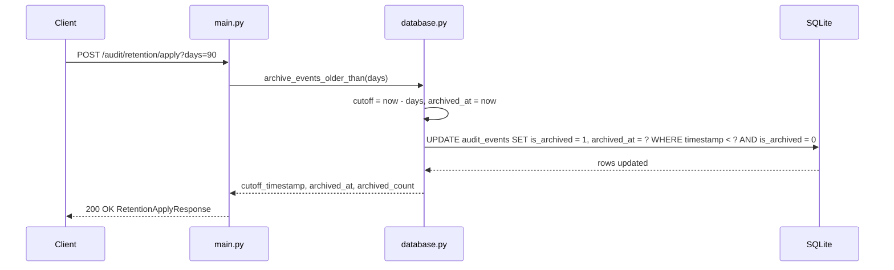
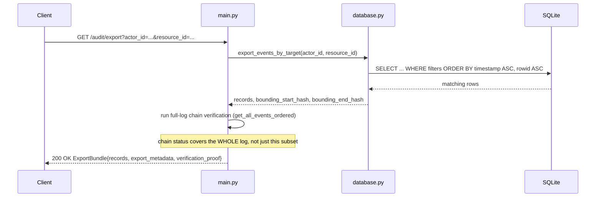
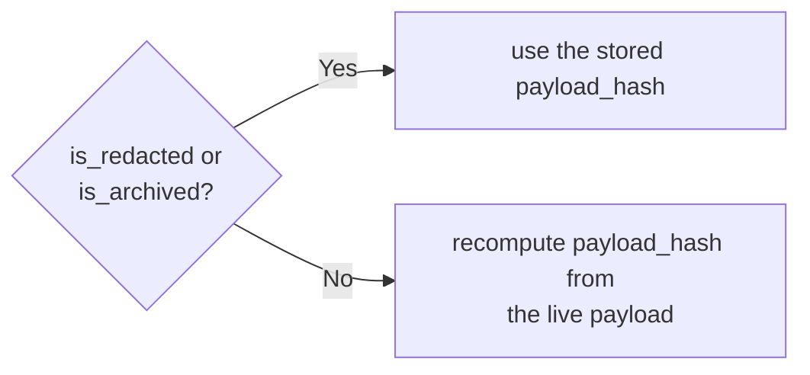

# Architecture

## Overview

The audit log service is a small FastAPI application backed by a single SQLite
file. It exposes three endpoints -- append an event, query events, and verify
the log's integrity -- and is deliberately **append-only**: there is no
update or delete endpoint anywhere in the API surface.

Every event is cryptographically chained to the one before it (a hash chain,
the same idea behind a blockchain or a git commit history), so any edit,
deletion, or reordering of a past record is detectable by walking the chain
and recomputing hashes.

## Components

- **main.py** -- FastAPI routes, Pydantic request/response schemas, and the
  `lifespan` hook that calls `init_db()` on startup.
- **crypto_utils.py** -- pure functions with no I/O: canonical payload
  hashing and the chained record hash.
- **database.py** -- the only code that touches SQLite. Opens a fresh
  connection per call (WAL journal mode, bounded lock `timeout`), and is the
  sole place that knows the table schema and SQL.
- **audit_log.db** -- a single SQLite file, one table (`audit_events`), with
  a `CHECK` constraint enforcing that `payload` is a valid JSON object.

## Write path: `POST /audit/events`

The server -- never the client -- assigns the `id` and `timestamp`, which is
what prevents a caller from manipulating ordering or backdating an event.
`rowid` (SQLite's implicit, strictly-increasing insertion counter) breaks
ties between events that land in the same second; the public `id` is a
random UUID and is unsuitable for that, since it carries no ordering
information.

## Hash chain

Each `record_hash` is a SHA-256 digest over `prev_hash` plus every immutable
field of the record. Changing any field of any past record -- or deleting or
reordering one -- changes that record's hash and breaks the link the next
record depends on.

## Read path: `GET /audit/events`

Fetching `limit + 1` rows lets the API decide `has_more` from the extra row
alone, avoiding a second `COUNT(*)` query.

## Verification path: `GET /audit/verify`

`HASH_MISMATCH` catches a record whose own fields were edited in place;
`CHAIN_DISCONTINUITY` catches a record that was inserted, deleted, or
reordered relative to its neighbors. The endpoint returns the first
violation found and stops there.

## Concurrency and storage

- SQLite runs in **WAL (write-ahead log)** mode, so concurrent readers
  (`GET /audit/events`, `GET /audit/verify`) do not block the single writer
  (`POST /audit/events`), and vice versa.
- Every connection opens with a `timeout`, so a request waiting on a lock
  fails with a clear error instead of hanging indefinitely.
- The table's real primary key for ordering purposes is SQLite's implicit
  `rowid`, not the public `id` (a random UUID) -- see `database.py` for why
  this matters once multiple events share the same one-second timestamp.

## Scenario B: Redaction, Retention, and Export

Building on the append-only log above, three more endpoints let a record's
payload be redacted, older records be archived, and a subset of the log be
exported for offline verification -- without ever deleting a row or
breaking the hash chain. The full cryptographic reasoning and threat model
are in [REDACTION_DESIGN.md](REDACTION_DESIGN.md); this section covers the
request flow for each endpoint.

### Schema additions

| Column | Purpose |
| --- | --- |
| `payload_hash` | The original payload's hash, persisted at ingestion time rather than only ever existing inside `record_hash`. Redaction preserves this value, which is what keeps `record_hash` -- and the chain -- valid afterward. |
| `is_redacted` | Set once any field on this record has been redacted. |
| `is_archived` | Set once this record has been archived by the retention policy. |
| `archived_at` | UTC timestamp of when archiving happened (`NULL` until then). |

### Redaction: `POST /audit/events/{record_id}/redact`

This is the one deliberate exception to "append-only, no in-place edits" --
see [REDACTION_DESIGN.md](REDACTION_DESIGN.md) for why leaving
`payload_hash`/`record_hash` untouched keeps the chain valid.

### Retention: `POST /audit/retention/apply`

Archiving never deletes a row: archived records stay fully queryable via
`GET /audit/events` and are still walked by `GET /audit/verify`.

### Export: `GET /audit/export`

`verification_proof` carries each exported record's own
`prev_hash`/`record_hash`/`payload_hash`, plus the subset's
`bounding_start_hash`/`bounding_end_hash` -- the entry and exit points of
this (possibly filtered) subset within the larger chain -- so a recipient
can recompute and confirm each record's `record_hash` offline without
needing the rest of the log.

### Verification, refined

`GET /audit/verify`'s per-record check (see the Verification path section
above) now branches on whether a record has been redacted or archived:

Everything else -- the `record_hash` recomputation and the `prev_hash`
chain-linkage check -- is unchanged. See
[REDACTION_DESIGN.md](REDACTION_DESIGN.md) for exactly what this does and
does not still catch, including the one non-obvious trade-off: this same
exemption also applies to archived-but-not-redacted records, even though
archiving alone never touches the payload.
