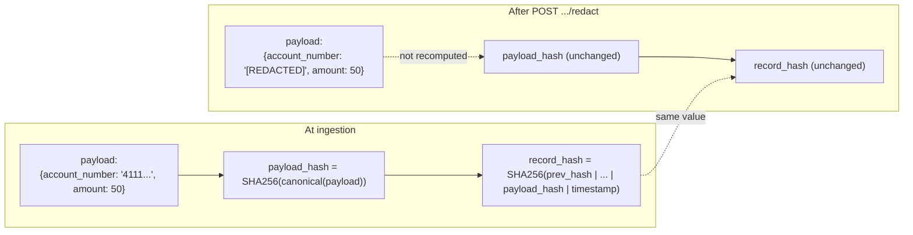
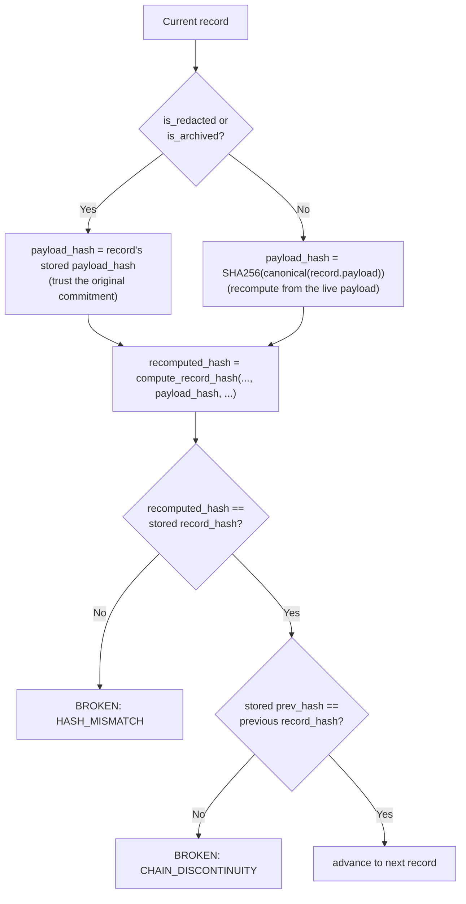

# Redaction Design

This document explains the cryptographic approach behind Scenario B
(redaction, retention, and export) -- specifically, how a record's payload
can be legitimately edited after the fact without breaking the tamper-evident
hash chain built for Scenario A. For the API surface itself, see
[ARCHITECTURE.md](ARCHITECTURE.md#scenario-b-redaction-retention-and-export).

## The problem

In Scenario A, `record_hash` is a SHA-256 digest over `prev_hash` plus every
field of the record, including a hash of the payload:

```
record_hash = SHA256(prev_hash | id | event_type | actor_id | resource_type
                      | resource_id | payload_hash | timestamp)
```

If you edit `payload` in place, `payload_hash` changes, so `record_hash`
changes, so the *next* record's `prev_hash` no longer matches -- the chain
looks broken from that point forward. The only way to "fix" that with a
naive design is to recompute `record_hash` for the edited record and then
cascade that recomputation through every record after it. That defeats the
purpose of an audit log: an external verifier who cached last week's chain
tip hash would find it silently invalidated, with no way to tell a
legitimate redaction from a cover-up.

But real systems need to redact sensitive fields (GDPR/CCPA erasure
requests, PCI-DSS data minimization, an accidentally-logged secret) without
losing the ability to prove *that an event happened, in this position in
the sequence, with this actor/resource/event_type* -- just not what the
sensitive field's value was.

## The core idea: separate the commitment from the content

`payload_hash` is computed once, at ingestion, and persisted as its own
column (`database.insert_audit_event`) -- it is not merely an intermediate
value thrown away after computing `record_hash`. `record_hash` is a
function of `payload_hash`, not of `payload` itself.

That one design choice is what makes redaction possible: **redaction
overwrites `payload`, but never touches `payload_hash` or `record_hash`.**
Since `record_hash`'s inputs haven't changed, it recomputes to the same
value it always did, so the chain -- including every record after it --
still verifies.



Put another way: `payload_hash` is a one-way commitment to the record's
*original* content, made at the moment the record was written. Redaction
can erase the content the commitment was made about, but it cannot (and
does not need to) erase the commitment itself -- and the commitment is all
`record_hash`, and therefore the chain, ever depended on.

## Verification model

`GET /audit/verify` (and the full-log check embedded in `GET /audit/export`)
runs the same per-record loop for every record, oldest to newest
(`main._run_chain_verification`):



The only change from Scenario A is *which* `payload_hash` value feeds into
the recomputation. For an untouched record, this is identical to Scenario
A: verification independently recomputes the payload's hash from its live
content, so tampering with `payload` directly is still caught as
`HASH_MISMATCH`, exactly as before. For a record with `is_redacted` or
`is_archived` set, verification trusts the persisted `payload_hash` instead.

## Threat model: what this does and doesn't catch

**Still detected, for every record regardless of redaction/archival status:**
- Any change to `prev_hash`, `record_hash`, `id`, `event_type`, `actor_id`,
  `resource_type`, `resource_id`, or `payload_hash` itself -- `HASH_MISMATCH`.
- Any inserted, deleted, or reordered record -- `CHAIN_DISCONTINUITY`.
- Direct tampering of `payload` on a record that is *not* redacted or
  archived (the common case) -- `HASH_MISMATCH`, exactly as in Scenario A.

**No longer detected, once `is_redacted` or `is_archived` is set:**
- Direct tampering of the live `payload` column's content. This is the
  intended trade-off for a *redacted* record (verification is supposed to
  stop caring what the redacted payload says). It is a **broader exemption
  than strictly necessary for an *archived-but-not-redacted* record**,
  since archiving alone never touches the payload -- an archived record's
  live payload would still hash correctly if it were checked. This
  blanket rule (`is_redacted OR is_archived`) was a deliberate, explicit
  design decision for this system, not an inherent requirement of
  redaction itself, and is worth re-confirming if the retention policy is
  ever expected to carry the same tamper-evidence guarantees as an
  unarchived record.

## What no hash-chain-only design can prove

A hash chain proves *internal consistency*: "this sequence of records is
well-formed and has not been edited, inserted, deleted, or reordered since
it was written, as far as the data in this file shows." It cannot prove
that the file itself hasn't been wholesale rewritten by someone with direct
write access to the SQLite database -- there is no external anchor (no
digital signature over each record, no append-only/WORM storage, no
periodic publication of the chain tip to an out-of-band, immutable
location). Anyone with raw DB access could, in principle, regenerate an
entirely different but internally self-consistent chain from scratch. This
is the same limitation `git` has against someone who controls a repository
outright and force-pushes a rewritten history. Closing this gap (if ever
required) would mean adding one of: asymmetric signatures over each
`record_hash` using a key the log-writing service doesn't itself hold,
periodic external timestamping/notarization of the chain tip, or
write-once storage for the database file. None of that is implemented
here; it's out of scope for this assignment, but stated explicitly rather
than implying a stronger guarantee than what's actually provided.

## Alternatives considered

1. **Cascading rehash on redaction** -- recompute `payload_hash` from the
   redacted payload, then recompute `record_hash` for that record and
   every record after it (since each later record's hash transitively
   depends on it). Rejected: this requires rewriting a potentially large
   tail of "immutable" history on every redaction, and defeats the audit
   trail's purpose -- a verifier who cached an earlier chain tip hash
   would see it silently invalidated, unable to distinguish a legitimate
   redaction from tampering.

2. **Field-level Merkle tree per payload** -- hash each payload field
   independently and combine them into a Merkle tree, with `record_hash`
   committing to the tree root instead of a single `payload_hash`.
   Redacting a field would drop its preimage but keep a proof stub, giving
   per-field verifiability ("every *other* field is provably untouched")
   rather than today's all-or-nothing payload commitment. Not implemented:
   meaningfully more complexity (a Merkle library, more bytes stored per
   record, proof construction/verification code) for a level of precision
   this assignment's scope doesn't call for. Noted here as the natural
   next step if per-field guarantees are ever needed.

3. **Physically deleting the sensitive row, leaving a hash-only tombstone**
   -- rejected outright: it breaks the chain (the next record's
   `prev_hash` would reference a hash with no backing row) and defeats the
   purpose redaction is meant to serve in the first place -- proving an
   event occurred, just not what its sensitive values were.

## Retention and export, briefly

- **Retention** (`POST /audit/retention/apply`) sets `is_archived` and
  `archived_at` as a soft flag; nothing is ever deleted, so archived
  records remain fully queryable and are still walked by
  `GET /audit/verify` -- with the same `payload_hash` exemption described
  above.
- **Export** (`GET /audit/export`) hands a recipient: the matching records
  (with their current, possibly-redacted payloads), the *whole log's*
  chain verification status at export time (not just the filtered
  subset), and a `verification_proof` letting the recipient independently
  recompute each exported record's own `record_hash` from its
  `payload_hash` and other fields. A filtered export's records are
  usually not adjacent to each other in the full chain, so the proof
  cannot show the subset forms a contiguous mini-chain on its own -- only
  a full, unfiltered export can be fully reconstructed and verified
  offline.
